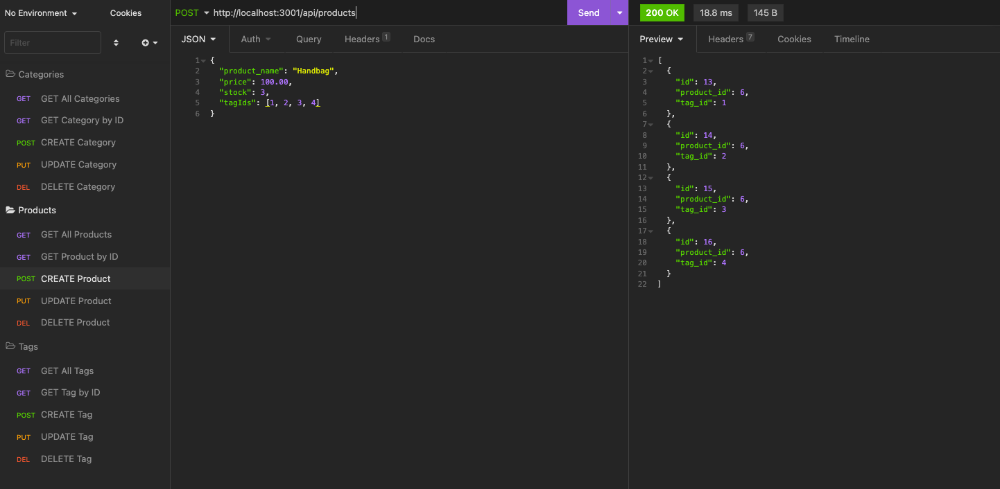

# Online Store Map

## Description

The Online Store Map is the back end for an e-commerce site and it uses Object-Relational-Mapping. Express.js API routes have been configured with Sequelize to interact with a MySQL database. The API routes are tested in Insomnia.

## Table of Contents

- [Installation](#installation)
- [Usage](#usage)
- [License](#license)
- [Contributing](#contributing)
- [Tests](#tests)
- [Questions](#questions)

## Installation 

This application uses Node.js, Express.js, MySQL Workbench, mysql2, and Sequelize. 

* Please use `npm i` to install the required packages.

* To create the tables for the database, add the db/schema.sql file data to your MySQL Workbench.

* Use `npm run seed` to seed the ecommerce database.

* See the .envEXAMPLE file for the information needed to secure your connection to the database.

Use `npm run watch` to start the server.

## Usage 

After creating an environment variable file and entering their MySQL credentials, the user is able to connect to the e-commerce database using Sequelize.

Setting up the database:

* Adding the MySQL commands found in the schema.sql file to the MySQL Workbench creates the e-commerce database.

* In the terminal, the command `npm run seed` will create the Category, Product, Product_Tag, and Tag tables, as well as seed them with the data.

Starting the application via the `npm run watch` command will start the server and sync the Sequelize models to the MySQL database.

The API routes for Categories, Products, and Tags can be tested in Insomnia.

* API GET routes return JSON formatted data. The GET routes are set up to return all or only by id.

* API POST routes allow for the creation of a Category, Product or Tag by entering JSON formatted data. The data that is needed is defined in the model as columns.

* API PUT routes allow for updating a Category, Product, or Tag by id. This is also complete by submitting JSON formatted data.

* API DELETE routes allow for the deletion of a Category, Product, or Tag by id.

[Walkthrough Video](https://drive.google.com/file/d/1FGh3oBhbylzJojPF0fDWia-azLnUEACX/view)

## License 

The Online Store Map is available under the MIT license.

Please see [LICENSE](./LICENSE) for the full details of the license.

## Contributing 

The contributors of this application have adopted the Contributor Covenant Code of Conduct. Please visit the [Code of Conduct](./CODE_OF_CONDUCT) page for details.

## Tests 

This application doesn't have any tests at this time.

## Questions 

Please reach out via the the link below with any additional questions. 

[GitHub](https://github.com/smdann)
